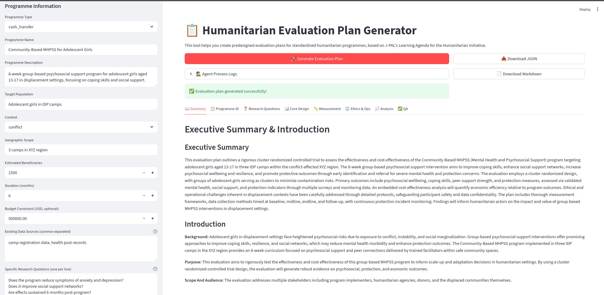

# Predesigned Evaluation Design for Standardised Humanitarian Programmes

> "Predesigned evaluations. When seeking to evaluate programmes that follow a relatively standardised model (e.g. cash transfers in emergency assistance, psychosocial support modules for survivors of violence), organisations could work with researchers to design the bulk of an evaluation design in advance (required sample size, predesign survey questions, pre-identify existing data sources that could be leveraged). " 
> --📚  J-PAL Humanitarian Initiative https://www.povertyactionlab.org/sites/default/files/HER-Learning-Agenda-4.7.22.pdf#page10  

The goal for this tool is to pre-define the core scientific and operational components to enable rapid, rigorous, and comparable evaluations across different contexts.




```bash
uv venv --python 3.12
source .venv/bin/activate
# Install dependencies
pip install -r requirements.txt

# Set up environment variables
cp .env.example .env
# Edit .env with your API keys
```

```bash
# Run the Streamlit app
streamlit run main.py
```


```python
# example.py
from crew import EvaluationPlanCrew
from models import ProgrammeInput, ProgrammeType, ContextType

# Define your programme
programme = ProgrammeInput(
    programme_type=ProgrammeType.PSYCHOSOCIAL_SUPPORT,
    programme_name="Community-Based MHPSS for Adolescent Girls",
    programme_description="""8-week group-based psychosocial support program 
    for adolescent girls aged 13-17 in displacement settings, focusing on 
    coping skills and social support.""",
    target_population="Adolescent girls in IDP camps",
    context=ContextType.DISPLACEMENT,
    geographic_scope="3 camps in XYZ region",
    estimated_beneficiaries=1500,
    duration_months=6,
    budget_constraint=500000,
    existing_data_sources=["camp registration data", "health post records"],
    specific_questions=[
        "Does the program reduce symptoms of anxiety and depression?",
        "Does it improve social support networks?",
        "Are effects sustained 6 months post-program?"
    ]
)

# Generate the plan
crew = EvaluationPlanCrew()
evaluation_plan = crew.create_plan(programme)

# Save the plan
with open("evaluation_plan.json", "w") as f:
    f.write(evaluation_plan.json(indent=2))
```


## Enhancement Ideas

### Add More Specialized Agents:

* Protection Specialist Agent
* Gender & Inclusion Agent
* Data Quality Agent
* Local Context Expert Agent

### Integrate External APIs:

* OCHA Humanitarian Data Exchange
* World Bank Indicators
* ACAPS Risk Data

### Add Validation Layer:

* Cross-check with SPHERE standards
* Validate against IASC guidelines
* Peer review simulation

### Implement Learning Loop:

* Store generated plans
* Track which designs get funded
* Improve based on outcomes
